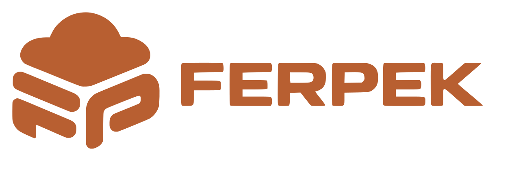
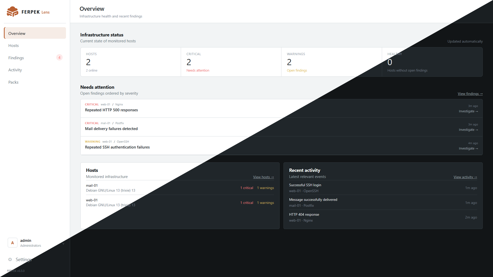
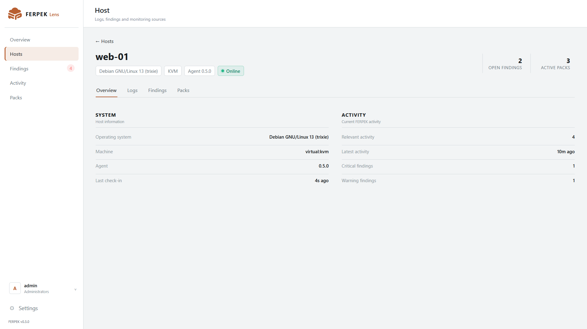
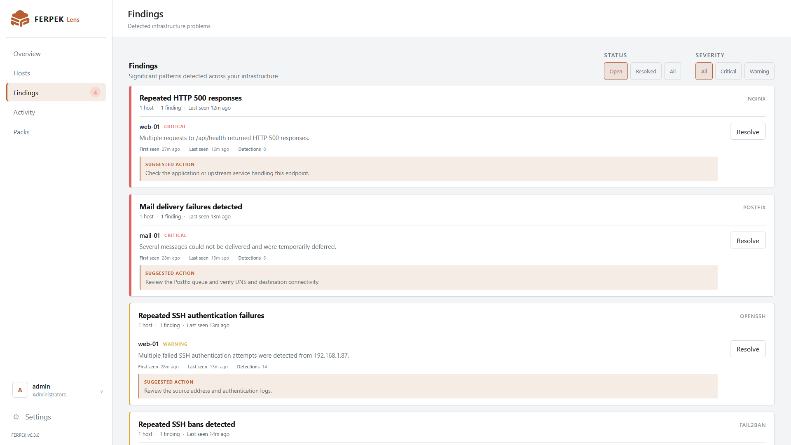

<p align="center">
  
</p>

<h1 align="center">FERPEK Lens</h1>

<p align="center">
  <strong>Open-source log analysis for system administrators.</strong>
</p>

<p align="center">
  Turn infrastructure logs into relevant activity and actionable findings.
</p>

<p align="center">
  
  
  
</p>

<p align="center">
  <a href="https://ferpek.com/products/lens/">Website</a>
</p>

> **FERPEK Lens is currently under active development.**  
> Expect breaking changes, limited platform support and a small initial pack catalog.

<p align="center">
  
</p>

## What is FERPEK Lens?

FERPEK Lens is an open-source log analysis platform built for system administrators.

A lightweight agent reads logs directly from your hosts. Packs understand the structure and meaning of those logs, and the FERPEK Lens server turns them into Relevant activity and Findings that are easier to understand and act on.

The goal is simple:

**Spend less time digging through logs and more time understanding what actually happened.**

FERPEK Lens is not intended to blindly collect everything and leave you with another massive pile of logs to search through.

The idea is to identify what is actually useful, surface important activity and provide enough context to investigate what happened.

That is intentional. I don't want FERPEK Lens to become another system that simply moves the log problem somewhere else.

## How it works

The basic architecture is:

```text
Host
│
|- Logs
│
v
FERPEK Agent
│
|- Source discovery
|- Pack processing
|- Relevant activity
L- Findings
│
v
FERPEK Lens Server
│
v
Web interface
```

Agents run on monitored hosts and communicate with the central FERPEK Lens server.

Packs define how different services are discovered, where their logs are located and how those logs should be interpreted.

The server provides a central place to manage hosts, packs, activity, findings and configuration.

## Host visibility

Each enrolled host has its own view where you can inspect its status, active packs, activity and findings.

<p align="center">
  
</p>

## Relevant activity

Not every log entry deserves the same level of attention.

FERPEK Lens can use packs to identify events that are useful enough to surface as Relevant activity without necessarily treating them as problems.

The goal is to give administrators a useful operational timeline without requiring them to manually search through raw log files.

## Findings

Findings represent events or conditions that may require attention.

Instead of showing only the raw log line, a pack can provide additional context about what happened and why it may matter.

<p align="center">
  
</p>

## Packs

Packs are how FERPEK Lens understands different services.

A pack can define things such as:

- Supported platforms
- Service discovery
- Log sources
- Parsing rules
- Relevant events
- Findings
- Detection logic

The long-term goal is for packs to be portable and largely declarative, allowing FERPEK Lens to support more services without having to modify the core agent for every integration.

Packs can also support more than one operating system where appropriate and adapt their behaviour according to the platform reported by the agent.

## Official packs

The official pack catalog is currently intentionally small while the pack architecture is being developed and hardened.

Current packs include:

- OpenSSH
- Nginx
- Fail2ban
- Postfix

More infrastructure services will be added over time.

## Current state

FERPEK Lens is still early and is being actively developed and tested.

The platform currently includes:

- Central FERPEK Lens server
- Web interface
- Lightweight Linux agent
- Host enrollment
- One-time enrollment tokens
- Source discovery
- Pack management
- Relevant activity
- Findings
- Raw log collection controls
- Declarative pack support
- Retention controls
- Local authentication
- Role-based access control
- LDAP authentication
- Active Directory authentication
- Light and dark themes

## Platform support

The agent is currently focused on Linux and has primarily been developed and tested on Debian-based systems.

Support for additional Linux distributions and other operating systems is planned, but should not currently be considered mature or officially supported.

Windows support is not available yet.

## Current limitations

FERPEK Lens is **not production-ready yet**.

Some of the current limitations are:

- Small official pack catalog
- Linux support currently focused on Debian-based systems
- No Windows agent support yet
- Installation workflows are still being improved
- Upgrade workflows are still being designed
- Documentation is still limited
- The pack system is still evolving
- Breaking changes may occur between versions

The current priority is to make the core platform, agent architecture and pack system reliable before significantly expanding the number of supported services and platforms.

## Quick start

The recommended deployment method for the FERPEK Lens server will be Docker.

The installation workflow is currently being finalized and tested.

A complete quick start will be added once a clean installation has been validated from scratch.

The intended experience is roughly:

```text
Deploy FERPEK Lens
        │
        ▼
Create the initial administrator
        │
        ▼
Install an agent on a host
        │
        ▼
Enroll the host
        │
        ▼
Discover available services
        │
        ▼
Enable packs
        │
        ▼
View Relevant activity and Findings
```

For now, FERPEK Lens should be treated as development software.

## Roadmap

Current priorities include:

- Expand the official pack catalog
- Improve pack portability
- Complete more declarative packs
- Improve installation and upgrade workflows
- Broaden Linux distribution support
- Add support for additional operating systems
- Improve documentation
- Improve onboarding
- Improve pack development tooling
- Make it easier for the community to build and share packs

The roadmap is intentionally flexible while the core architecture is still evolving.

## Why I'm building it

I'm a sysadmin myself, a fairly new one. I've been doing this professionally for about two years.

A lot of infrastructure troubleshooting eventually ends up in the same place: logs.

Sometimes I know exactly what I'm looking for. Other times I'm opening different files, grepping through them, comparing timestamps and trying to understand what actually happened.

FERPEK Lens started as an attempt to make that process easier for myself.

I originally made this mostly for myself.

Then I got a little carried away with it.

I made a name, a logo, branding, an interface, agents, packs... and somehow I've now been working on this for almost two months in my free time after work.

So I decided to make it open source.

If other sysadmins find it useful, great! And if the community wants to contribute new packs, rules, improvements or completely new ideas, even better!

I've already learned a lot while building FERPEK Lens, and that's also a big part of why I'm continuing to work on it.

I'd like FERPEK Lens to become sustainable in the future, while keeping the core project open source.

I'm also completely open to constructive criticism.

You can tell me something is badly designed, that I'm solving the problem the wrong way, etc... I'll listen to the feedback, good or bad.

## Contributing

FERPEK Lens is still at an early stage, but contributions, ideas and feedback are welcome.

The contribution workflow and pack development documentation will be expanded as the project becomes more stable.

For now, GitHub issues can be used for bug reports, suggestions and discussion.

## Website

https://ferpek.com/products/lens/

## License

FERPEK Lens is licensed under the GNU Affero General Public License v3.0 only (AGPL-3.0-only).

See [LICENSE](LICENSE) for details.
